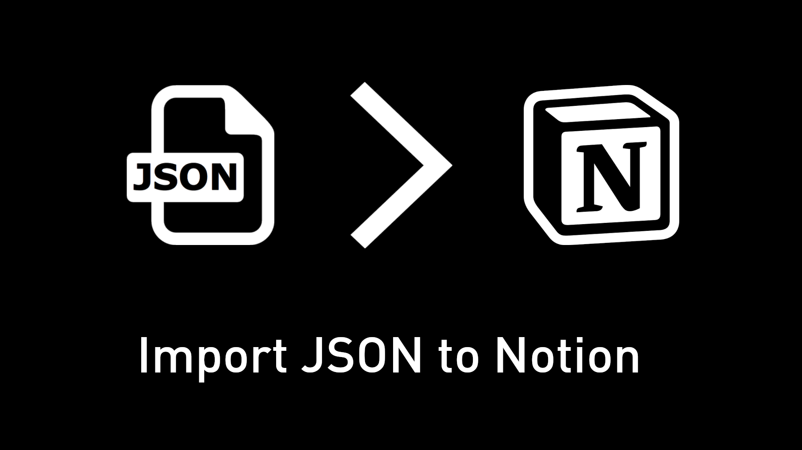

# Import JSON files to Notion



Utility that is able to "import" JSON files to Notion - for cases where a CSV file is simply not available, and the conversion from JSON to CSV would be too complicated.

## Setup 

Run `npm install` to install the required dependencies first.

Following this, create a `config.json` file in the root directory of the project and fill it with your desired [configuration](#configuration).

If you haven't already done so, you can obtain a Notion integration key by creating an (internal) Notion integration for your workspace.
You can follow [this guide](https://developers.notion.com/docs/create-a-notion-integration) to learn how to do so.
You will need this key to run the integration locally.

**IMPORTANT: Don't forget to connect the integration to your database, as described in the guide! Otherwise, the import won't work.**

## Usage

After providing the `config.json` [configuration](#configuration) file, you can run the script using

```bash
node index.js
```

The script will now automatically import the specified JSON properties to your Notion database.

## Configuration

### Schema validation

The project provides an extensive JSON validation schema for the required configuration file.
This makes sure that the script is able to run without any issues.

The schema can be found in the `config.schema.json` file and used within your `config.json` by adding the following property:

```json
"$schema": "config.schema.json"
```

*NOTE: The script will test your provided `config.json` against this schema, so make sure your configuration is valid.*

### Properties

The following is a list of all configuration items, their defaults and the values they can take.

#### Top-level properties

<details>
<summary><code>notionIntegrationKey</code></summary>

The secret integration key for your Notion integration. Find it on your integration dashboard after creating a new integration on https://www.notion.so/my-integrations

| Type | Default value | Possible values | Required |
| --- | --- | --- | --- |
| `string` | `""` | A valid Notion integration key | Yes |
</details>

<details>
<summary><code>notionDatabaseId</code></summary>

The ID of the database you want to run the integration on. You can find the ID in the URL of your database, e.g. https://www.notion.so/myworkspace/your-database-id

| Type | Default value | Possible values | Required |
| --- | --- | --- | --- |
| `string` | `""` | A valid Notion database ID | Yes |
</details>

<details>
<summary><code>inputFile</code></summary>

The JSON file to import to Notion.

| Type | Default value | Possible values | Required |
| --- | --- | --- | --- |
| `string` | `"input.json"` | A valid JSON file(path) | Yes |
</details>

<details>
<summary><code>skipExisting</code></summary>

Whether to skip existing entries in the database. If set to true, the script will only import entries that do not exist in the database yet.

| Type | Default value | Possible values | Required |
| --- | --- | --- | --- |
| `object` | See item below | See sections below | No |

```json
{
	"enabled": false,
	"jsonKey": "keyInJSON",
	"notionProperty": "ItemId",
	"propertyType": "number"
}
```

<h3>Possible values</h3>

<h4><code>enabled</code></h4>

Whether to skip existing entries in the database.

| Type | Default value | Possible values | Required |
| --- | --- | --- | --- |
| `boolean` | `false` | `true` or `false` | Yes |

<h4><code>jsonKey</code></h4>

The key in the JSON input that should be compared to the value of the `notionProperty`.

| Type | Default value | Possible values | Required |
| --- | --- | --- | --- |
| `string` | `"keyInJSON"` | A key that exists in the items of the input file | Yes |

<h4><code>notionProperty</code></h4>

The name of the field in the Notion database that should be compared to the value of the `jsonKey`.

| Type | Default value | Possible values | Required |
| --- | --- | --- | --- |
| `string` | `"ItemId"` | An existing Notion property name | Yes |

<h4><code>propertyType</code></h4>

The type of the property in the Notion database that should be compared to the value of the `jsonKey`.

| Type | Default value | Possible values | Required |
| --- | --- | --- | --- |
| `string` | `"rich_text"` | `"rich_text"`,	`"title"`, `"number"`, `"select"` or `"url"` | Yes |
</details>

<details>
<summary><code>writeErroredObjectsToFile</code></summary>

Whether to write the input objects that failed to be imported to Notion to a file. This speeds up the process of cleaning up those errors and trying again.

| Type | Default value | Possible values | Required |
| --- | --- | --- | --- |
| `boolean` | `true` | `true` or `false` | No |
</details>

<details>
<summary><code>extraProperties</code></summary>

Extra properties to add to the Notion database. These properties will be added to every row in the database.

| Type | Default value | Possible values | Required |
| --- | --- | --- | --- |
| `array` | See item below | See sections below | No |

```json
[
	{
		"notionPropertyName": "Imported by",
		"propertyValue": "Imported using JSON to Notion",
		"notionPropertyType": "rich_text"
	}
]
```

<h3>Possible values</h3>

<h4><code>notionPropertyName</code></h4>

The Notion property name to map to the JSON key.

| Type | Default value | Possible values | Required |
| --- | --- | --- | --- |
| `string` | `"Imported by"` | A valid Notion property name | Yes |

<h4><code>notionPropertyType</code></h4>

The type of the Notion property. Note: Not all property types are supported as of now. Unsupported types that may get supported later on: status, files, checkbox, email, phone number. If you would like one of these supported, please open an Issue on the project's Github page.

| Type | Default value | Possible values | Required |
| --- | --- | --- | --- |
| `string` | `"rich_text"` | `"rich_text"`,	`"title"`, `"number"`, `"select"`, `"multi_select"`, `"date"` or `"url"` | Yes |


<h4><code>propertyValue</code></h4>

The value to add to the Notion property.

| Type | Default value | Possible values | Required |
| --- | --- | --- | --- |
| `string` | `"Imported using JSON to Notion"` | The type of object depends on the `notionPropertyType` and will be passed directly to the Notion API. | Yes |
</details>

<details>
<summary><code>propertyMappings</code></summary>

The mapping of JSON keys to Notion property names. If an existing JSON key is not mapped, it will be ignored.

| Type | Default value | Possible values | Required |
| --- | --- | --- | --- |
| `array` | See item below | See sections below | Yes, at least one item |

```json
[
	{
		"jsonKey": "keyInJson",
		"notionPropertyName": "keyInNotion",
		"notionPropertyType": "rich_text",
		"nestedObjectPolicy": {
			"policy": "useNamedProperty",
			"namedProperty": "nameOfNestedProperty"
		}
	}
]
```
</details>

### propertyMappings

<details>
<summary><code>jsonKey</code></summary>

The JSON key to map to the Notion property.

| Type | Default value | Possible values | Required |
| --- | --- | --- | --- |
| `string` | `"keyInJson"` | A key that exists in the items of the input file | Yes |
</details>

<details>
<summary><code>notionPropertyName</code></summary>

The name of the Notion property to map to the JSON key.

| Type | Default value | Possible values | Required |
| --- | --- | --- | --- |
| `string` | `"keyInNotion"` | An existing Notion property name | Yes |
</details>

<details>
<summary><code>notionPropertyType</code></summary>

The type of the Notion property. Note: Not all property types are supported as of now. For `multi_select`, the input string will be split along `,` to create multiple entries. Combine this with the `nestedObjectPolicy` "`concatenateProperties`".

| Type | Default value | Possible values | Required |
| --- | --- | --- | --- |
| `string` | `"rich_text"` | `"rich_text"`,	`"title"`, `"number"`, `"select"`, `"multi_select"`, `"url"`, `"date"`, `"cover"` or `"icon"` | Yes |
</details>

<details>
<summary><code>nestedObjectPolicy</code></summary>

The policy to use when the value to the specified JSON key another JSON object. This is useful when the JSON value is an object that contains multiple properties that should be mapped to a single Notion property.

| Type | Default value | Possible values | Required |
| --- | --- | --- | --- |
| `object` | See item below | See sections below | No |

```json
{
	"policy": "useNamedProperty",
	"namedProperty": "nameOfNestedProperty"
}
```

<h3>Possible values</h3>

<h4><code>policy</code></h4>

The policy to use when the value to the specified JSON key another JSON object.

| Type | Default value | Possible values | Required |
| --- | --- | --- | --- |
| `string` | `"useNamedProperty"` | `"useNamedProperty"`, `"concatenateProperties"` or `"usePriorityList"` | Yes |

<h4><code>namedProperty</code></h4>

The name of the property to use when the `policy` is set to `useNamedProperty`.

| Type | Default value | Possible values | Required |
| --- | --- | --- | --- |
| `string` | `"namedProperty"` | A key that exists in the items of the input file | Yes, if the `policy` is `useNamedProperty` |

<h4><code>priorityList</code></h4>

The prioritized list of properties to use when the `policy` is set to `usePriorityList`. The script will use the value of the property with the highest priority.

| Type | Default value | Possible values | Required |
| --- | --- | --- | --- |
| `array` | See item below | A list of strings | Yes, if the `policy` is `usePriorityList` |

```json
[
	"highestPriorityProperty",
	"secondHighestPriorityProperty"
]
```
</details>

## Related projects

If you are using Notion to organize your Steam game library, you might be interested in the [Notion Steam API integration](https://github.com/NikkelM/Notion-Steam-API-Integration) project, an integration that automatically retrieves information for Notion entries that contain a Steam App ID.

Similarly, you can use the [Game Pass API](https://github.com/NikkelM/Game-Pass-API) to retrieve information about all games currently available on Game Pass, and then import that information using this tool.

## Feedback

If you have any question, feedback or feature requests, feel free to open an [issue](https://github.com/NikkelM/JSON-to-Notion/issues/new).